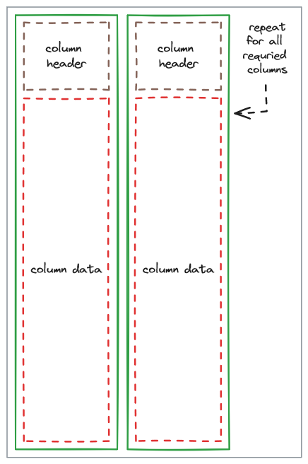
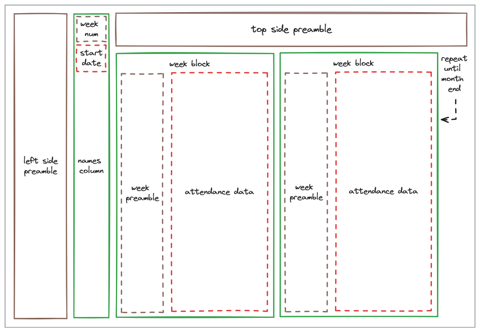

# NTU canoebot
A bot that automates daily tasks for NTU Canoe Sprint

---

## Prerequisites

- [Install rust](https://rustup.rs)

- [Install docker engine](https://docs.docker.com/engine/install/)

---

## Building
Before building, [configure settings first.](#configuring-settings)


### Dev
```sh
cargo run
```

### Deploy
```sh
# if you have make on your system
make    # build
make up # run

# if you don't have make on your system
docker build -t ntu_canoebot_cache -f docker/cache.Dockerfile .
docker compose build
docker compose up -d
```

## Configuring settings
Before building the bot, it needs to be set up with an API key and to point to all necessary Google resource IDs in order to function properly.

These keys are used to generate code at compile-time for the bot,
so that all configuration data is "baked" into the executable.

Create 2 copies of `botsettings.template.d.toml`:
- `botsettings.template.deploy.toml` (mandatory)
- `botsettings.template.debug.toml` (optional)

Fill in all keys except those marked optional

### Review
Altogether there should now be 4 'template' TOML files inside `.configs`:
- `botsettings.template.toml`
- `botsettings.template.d.toml`
- `botsettings.template.deploy.toml` (mandatory)
- `botsettings.template.debug.toml` (optional)

To use either `debug` or `deploy` configuration, set the "use" key to true and rebuild:
```toml
# set to true to use this config
use = true

# ... the rest
```

---

## Configuring Google Sheets
The main attendance spreadsheet should be composed of the following sheets:
- a configuration sheet named "configs"
- monthly attendance spreadsheets, labelled `%b-%Y` (e.g. Jan-2020)
- land training sheets for each semester

### Configuration sheet
The configuration sheet contains boat allocation and other data associated with each individual.
Naturally, names in the config sheet should match with names in the monthly attendance sheet in order to perform allocations.

The config sheet has a looser layout to adhere to compared to the attendance sheets.
Each column header must be located at the first row (row 1), and contain its associated data down the column.
As this sheet is indexed by column name, locations and arrangement of columns do not matter.

Currently, there are 6 columns required to run the bot. These fields can be found in table [`sheetscraper.columns`](./.configs/botsettings.template.toml). Headers in the config sheet must match with each entry in this config file.

<picture>
    <source media="(prefers-color-scheme: light)" srcset=".media/sheet_config_light.png">
    <source media="(prefers-color-scheme: dark)" srcset=".media/sheet_config_dark.png">
    
</picture>

### Monthly attendance sheet
Each monthly sheet follows the layout shown below.
Blocks highlighted in red contain data used by the bot.

Attendance data in each week block must contain exactly 14 columns, 2 for each day.

Start date refers to a single cell that must be formatted according to [`sheetscraper.date_format`](./.configs/botsettings.template.toml). In this instance, the default format is `%d-%b-%y`.

The sizes of each _preamble_ block (in brown) are controlled by config parameters in table [`sheetscraper.layout.attd`](./.configs/botsettings.template.toml).

Inside each attendance data cell, `Y` indicates that someone is attending,
and anything else indicates that someone is not attending.

<picture>
    <source media="(prefers-color-scheme: light)" srcset=".media/sheet_layout_light.png">
    <source media="(prefers-color-scheme: dark)" srcset=".media/sheet_layout_dark.png">
    
</picture>

### Land attendance sheet
This sheet contains fixed weekly attendance for land trainings. The layout is similar to the monthly attendance sheet.

The sheet name follows the format `gym-YYSX`. E.g. `gym-20S1` marks the attendance for the first semester of academic year 2020. Currently, an academic year starts in August and the semester changes in January of the following year. (`gym-20S2` starts on January 2021)

Just like monthly attendance sheets, the sizes of each _preamble_ block are controlled in table [`sheetscraper.layout.land`](./.configs/botsettings.template.toml).

The first 5 odd columns (10 total columns) inside attendance data are used to indicate attendance for every weekday from Monday to Friday. Even columns are not used. The same rules for marking attendance apply.

<picture>
    <source media="(prefers-color-scheme: light)" srcset=".media/land_layout_light.png">
    <source media="(prefers-color-scheme: dark)" srcset=".media/land_layout_dark.png">
    
</picture>

### Programme spreadsheet
Daily training programme is located in a separate spreadsheet.
This spreadsheet must only contain one sheet, and it can be arbitrarily named.

This sheet layout is similar to the configs sheet, with 3 required columns. These fields can also be found in table [`sheetscraper.columns`](./.configs/botsettings.template.toml).

Under the date column, each cell must follow the date format defined in [`sheetscraper.date_format_prog`](./.configs/botsettings.template.toml).
The default format is `%Y-%m-%d`.

## Setup: Telegram
These are the current list of public commands available. Copy and paste these when [setting commands with BotFather:](https://core.telegram.org/bots#botfather-commands)

    help - help
    reload - refresh sheet data
    version - bot version
    namelist - see who's going training
    training - view training program
    paddling - full paddling attendance
    land - full land attendance
    weeklybreakdown - attendance breakdown
    logsheet - SCF logsheet
    what - what is it?
    whatactually - what is it actually?
    emojivomit - emoji vomit
    uwuify - uwu
    silence - silence someone/something


<!-- src - view SRC facilities -->

<!-- whoami - who u -->

<!-- countdown - days left to ITCC -->

---

<!-- ## Usage: interaction

 -->

## FAQ

### Why did you compile the configuration file into the program? Can't you use an .env file instead for faster rebuilds?
An `.env` file points a key to a string value. Non-string values loose their type information.

Key-value pairs in the config preserve their type information using some codegen trickery, so errors will reveal themselves at compile time instead of runtime.

Changes to config files will trigger a rebuild of the [codegen crate](./crates/ntu_canoebot_config/).

### Why did you switch from python to rust?
Having switched from deploying directly on a VM to using containers, I wanted to create a smaller container image.

The python image is over 300MB in size, while the rust image turned out to be less then 16MB.

The rust version uses less memory too, ~30MB compared to ~150MB.

### Why are there 2 dockerfiles?
Rust has long compile times. Without a cache layer, rebuilding an image downloads and recompiles the same crates more than once.

A solution to this problem is to create a cache layer populated with only cargo manifest files and dummy entry points (`main.rs`, `lib.rs`, `build.rs`). This layer will only need to be rebuilt if any cargo manifest file changes.

TL;DR: build cache layer reduces recompilation time
